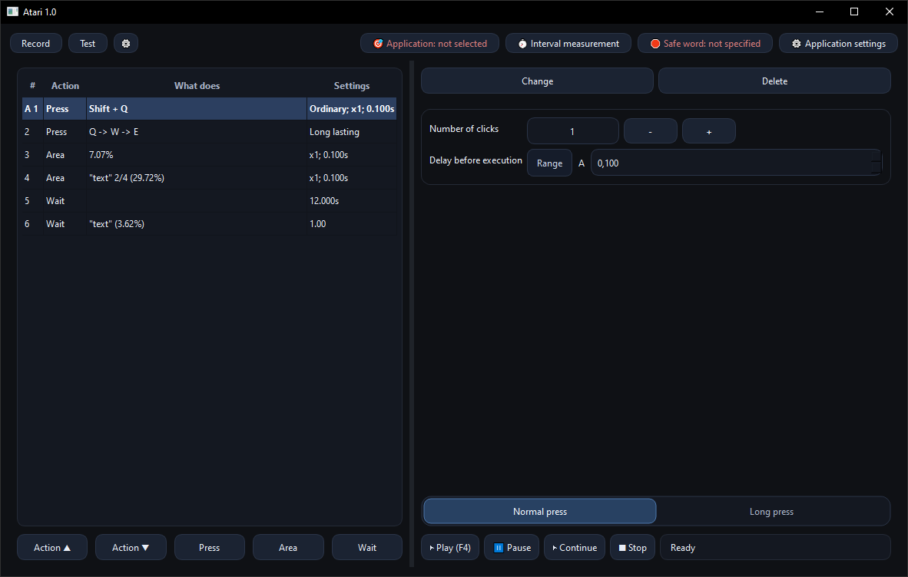
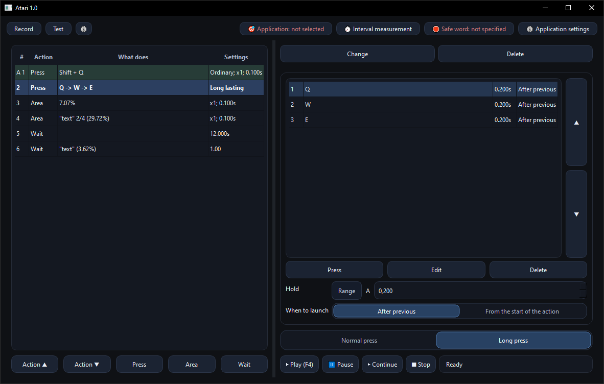
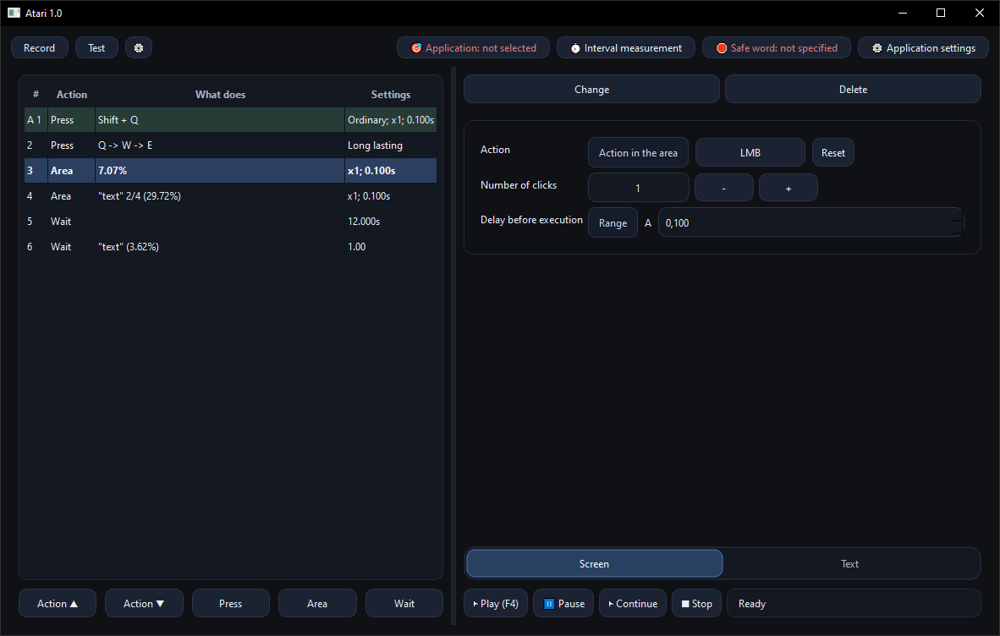
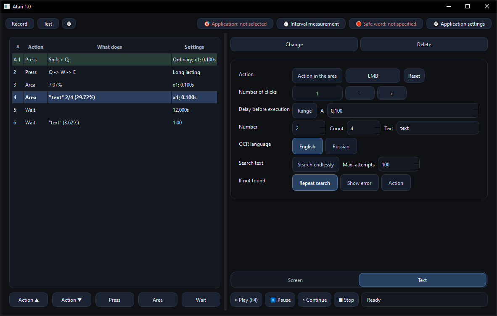
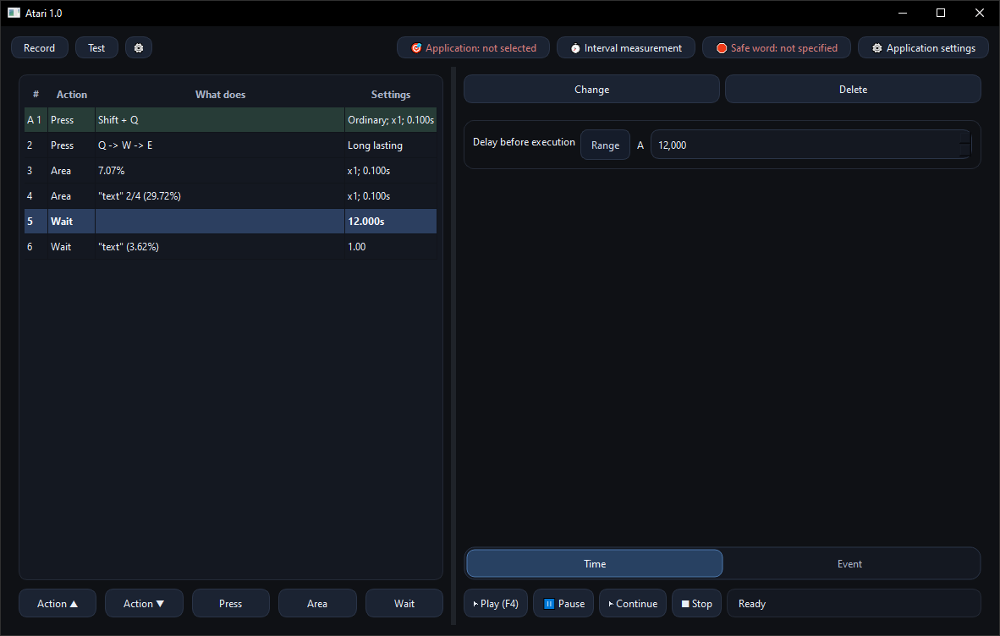
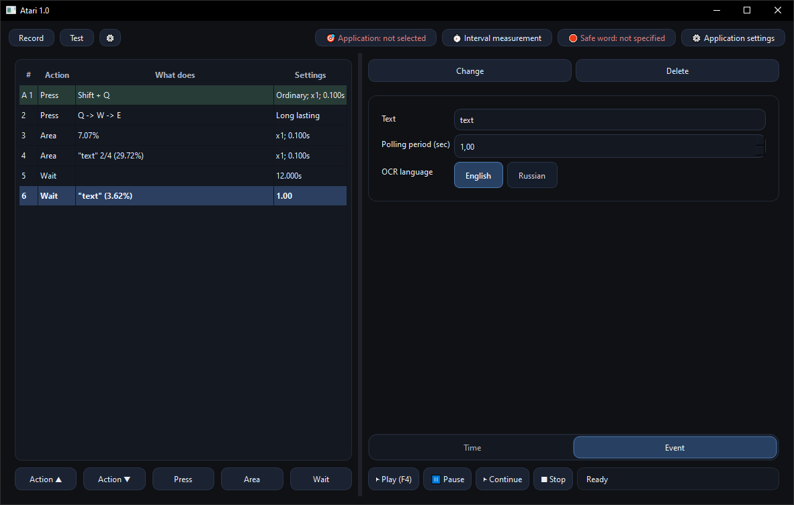

# Atari

**Atari** is a GUI macro tool for automating repetitive manual actions — especially in games and other “click/keypress-heavy” workflows.  
It can replay keyboard/mouse sequences, interact with selected screen regions, and (optionally) use OCR to **find text on the screen** or **wait until text appears**.

---

## What Atari can do

### Input actions (keyboard / mouse)
- **Normal press** — press a key combo or mouse click.
- **Long press (timeline)** — hold keys/mouse and execute additional triggers with configurable timing:
  - Start timing “from start” or “after previous”
  - Useful for “hold key, then click after 0.2s, then press another key…”
 
<table>
  <tr>
    <td></td>
    <td></td>
  </tr>
</table>

### Screen region actions
- **Area action** — interact in a selected region (supports multi-press / repeats).
- **Base Area** — set a “reference” region so other actions can be stored **relative** to it (more resolution/window-position tolerant).

### OCR text actions (optional)
- **Text-in-area** — search for a text string in a region, optionally click the found text.
- Built-in fail-handling:
  - retry
  - throw an error
  - run a custom “on fail” action list (and optionally stop or restart the whole macro)
 
<table>
  <tr>
    <td></td>
    <td></td>
  </tr>
</table>

### Wait actions
- **Wait (time)** — fixed or random range delay.
- **Wait for event (text)** — poll OCR until expected text appears (recommended to limit the area instead of scanning full screen).

<table>
  <tr>
    <td></td>
    <td></td>
  </tr>
</table>

---

## Good use cases

### Games (where allowed)
- Repetitive crafting/production UI clicks
- Farming loops that require simple, predictable input
- “Wait until UI text appears, then continue” flows (OCR)

Example: **Foxhole** (if permitted by rules)  
You can automate *benign* repetitive UI workflows like opening a production menu, selecting an item, confirming, repeating — especially when combined with “wait until text appears” to synchronize with UI states.

### Desktop / productivity
- Repetitive GUI data entry (non-sensitive)
- QA / UI testing for simple flows
- Personal automation where full RPA tools are overkill

---

## Keyboard layout rule (important)

For best reliability, **run playback using the same keyboard layout that the recording was created with**.

On Windows, Atari also includes a RU→US physical-key mapping to reduce layout-related mismatches, but matching the layout is still the safest approach.

---

## OCR setup (Tesseract)

Some features (text search / wait-for-text) require **Tesseract OCR**.

1. Install Tesseract:
   - https://github.com/tesseract-ocr/tesseract
2. Add Tesseract to **Windows PATH** (System Environment Variables)
3. Install OCR language packs
4. Restart Atari after installing OCR components

### OCR tips
- Recommended minimum text length for recognition: **~5+ characters**
- Keep the OCR region tight (don’t scan full screen unless you must)
- UI scaling / HiDPI can affect OCR; smaller text usually works better with a tighter region

---

## Known issue

On some PCs, the overlay (key bind display / area selection overlay) may not appear for unknown reasons.
